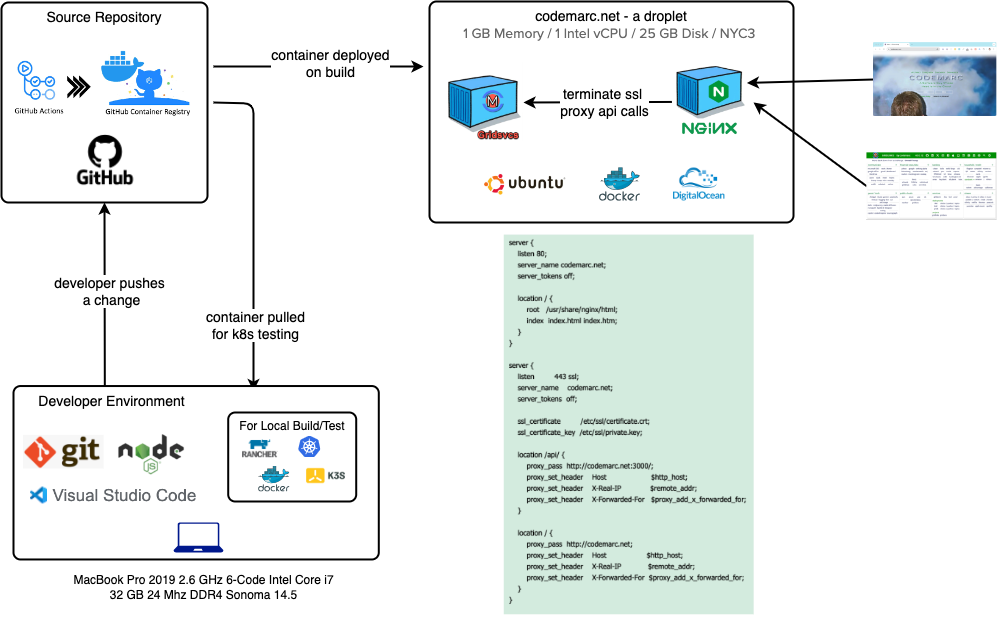

# Gridsvcs  

<a href="https://codemarc.net/doc/gridlinks">microservices for gridlinks</a> 
 

In modern software development, monolithic applications, where all components are tightly coupled and deployed as a single unit, are increasingly being replaced by a more modular and scalable approach called microservices architecture. Microservices are small, independent services that work together to form a larger application.

As a part of the gridlinks project roadmap we plan to create a set of microservices, referred to as "gridsvcs". These microservices are intended to support the gridlinks application and provide an illustration or example of how to create and deploy microservices.

Microservices are an architectural style where a large application is broken down into smaller, independent services that communicate with each other using lightweight protocols like HTTP or message queues. Each microservice is responsible for a specific business capability and can be developed, deployed, and scaled independently.

By creating a set of microservices called "gridsvcs", the Gridlinks project aims to demonstrate the process of building and deploying microservices. These microservices will likely provide various functionalities or services that support the Gridlinks application, such as authentication, data storage, or other backend services.

## Services

### Motd

## Developer Workflow

<!--
---
[Back «](#Gridsvcs)  __Services__  [» Next](publish)
 -->

<!-- Engage Cloaking Device -->
[project]: https://github.com/codemarc/gridsvcs
[docs]: https://github.com/codemarc/gridsvcs/tree/master/doc
[docsite]: https://codemarc.net/doc/gridsvcs
[docsify]: https://docsify.js.org/#/

